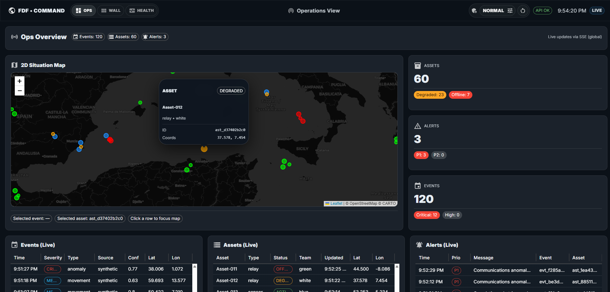
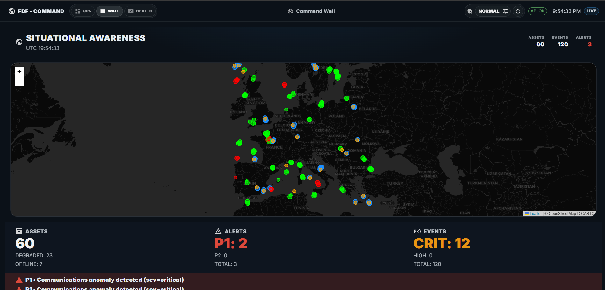
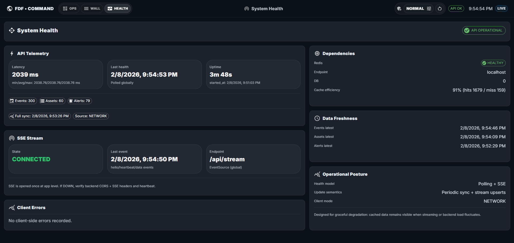

# Federated Data Fusion (FDF)


**Federated Data Fusion (FDF)** is a full-stack **situational awareness and command dashboard** built to demonstrate real-time data fusion, operational monitoring, and event correlation.

The system combines a **Python/FastAPI backend** with a **React/Redux frontend**, connected through REST APIs and **Server-Sent Events (SSE)** for live updates.

---

## Live Demo / Media

[**LIVE DEMO** (COMING SOON]

> Screenshots and short recordings are provided below to illustrate the operational views and workflows.

---

## Screenshots

### Ops View


### Wall View


### Health View


---

## Repository Structure

```
root/
├── backend/
│   ├── app/
│   │   ├── main.py
│   │   ├── models.py
│   │   ├── generators.py
│   │   ├── redis_client.py
│   │   ├── config.py
│   │   └── routes/
│   ├── Dockerfile
│   ├── requirements.txt
│   └── docker-compose.yml
│
├── frontend/
│   ├── src/
│   │   ├── api/
│   │   ├── components/
│   │   ├── layouts/
│   │   ├── store/
│   │   ├── views/
│   │   └── tests/
│   └── package.json
│
└── README.md
```

---

## Backend Overview

### Technology Stack

* Python
* FastAPI
* Pydantic / pydantic-settings
* Redis
* Server-Sent Events (SSE)
* Docker

---
## Data Generation & Simulation

The backend includes a **built-in data generation and simulation layer** designed to emulate realistic operational telemetry without relying on external data sources.

### Purpose

The simulation layer is used to:

- provide reproducible and deterministic demo scenarios
- exercise real-time data flows (REST + SSE)
- validate frontend state management under continuous updates
- decouple UI development from live or sensitive data feeds

### Generated Entities

The system continuously generates the following entity types:

- **Events**
  - geospatially distributed
  - variable severity levels (`low`, `medium`, `high`, `critical`)
  - confidence scores and timestamps

- **Assets**
  - dynamic status transitions (`active`, `degraded`, `offline`)
  - periodic position and heartbeat updates
  - ownership and type metadata

- **Alerts**
  - rule-based correlations derived from events and asset states
  - prioritized warnings (`p1`, `p2`, `p3`)
  - optional linkage to related events or assets

### Execution Model

- Data generators run as **background tasks** inside the FastAPI application
- Generated state is written to **Redis**, acting as the single source of truth
- Each state mutation propagates through the system:
  - REST endpoints expose the latest snapshot
  - SSE streams push incremental updates to connected clients in near real time

### Scenario Control

An administrative control layer allows operators to:

- switch between predefined scenarios (e.g. normal load, stress conditions)
- dynamically adjust generation rates
- reset the simulated environment to a clean baseline

This enables controlled demonstrations of system behavior under varying data volumes and update frequencies.

### Design Philosophy

The simulation layer is intentionally:

- simple and transparent
- easy to extend with new rules or entity types
- structurally aligned with real-world monitoring and telemetry pipelines

Although the data is synthetic, its structure and behavior closely mirror production-grade event and monitoring systems.

---

### Backend Responsibilities

* Generate synthetic events, assets, and alerts
* Maintain shared state in Redis
* Expose REST APIs for querying state
* Stream live updates via SSE
* Provide admin endpoints for scenario control and reset

---

### Key API Endpoints

```
GET  /api/events
GET  /api/assets
GET  /api/alerts

GET  /api/health
GET  /api/stream        # SSE

GET  /api/admin/state
POST /api/admin/scenario
POST /api/admin/reset
```

---

### Health Endpoint

The `/api/health` endpoint reports:

* API operational status
* uptime
* entity counts
* Redis dependency status
* freshness timestamps

This endpoint feeds the frontend **Health View** directly.

---

### Redis Usage

Redis is used for:

* centralized state storage
* fast lookup and counters
* pub/sub fan-out for SSE clients

The backend uses a single centralized Redis client, designed to be easily replaceable with Redis Sentinel or Cluster if required.

---

## Frontend Overview

### Technology Stack

* React 18
* Redux Toolkit
* Material UI
* Native EventSource (SSE)

---

### Frontend Responsibilities

* Maintain normalized application state (events, assets, alerts)
* Perform periodic full syncs via REST
* Apply incremental updates via SSE
* Persist cache in `localStorage` for fast reloads
* Render operational dashboards and command views

---

### Main Views

#### Ops View

* Tabular live view of events, assets, and alerts
* KPI cards (status, severity, priority)
* Interactive 2D map
* Row selection syncs with map focus

#### Wall View

* Full-screen command wall layout
* Large KPIs optimized for displays
* Live map and alert ticker
* Minimal operator interaction

#### Health View

* API and dependency status
* Redis health and hit rate
* SSE connection status
* Client-side error tracking

---

## Real-Time Data Flow

1. Backend generators produce synthetic data
2. Data is written to Redis
3. Backend publishes updates via SSE
4. Frontend receives events and updates Redux store
5. UI re-renders in near real time

REST polling is used as a safety net and for cold-start hydration.

---

## Running the Project (Docker)

### Backend

```
cd backend
docker-compose up --build
```

Backend will be available at:

```
http://localhost:8000
```

---

### Frontend

```
cd frontend
npm install
npm run dev
```

Frontend will be available at:

```
http://localhost:5173
```

---

## Testing

The frontend includes automated unit and integration tests covering:

* OpsView
* WallView
* HealthView
* Layout and navigation logic

Tests are implemented using **Jest** and **React Testing Library**, with mocked SSE streams and DataGrid components to ensure deterministic results.

---

## Project Goals

This project is intended to demonstrate:

* clean separation between simulation, API, and UI
* real-time data delivery with SSE
* resilient frontend state management
* operational UI design for monitoring environments

It is **not** a production system, but an extensible and realistic foundation for experimentation, demos, and portfolio presentation.

---

## License

Open Source. Free to use, modify, and extend.
